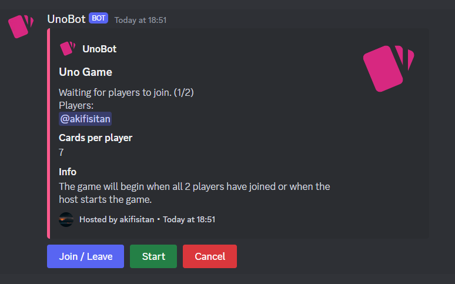

 
 <h1 align="center">
  unocord
 </h1>

unocord is a bot which allows server members to play Uno.

## Features

- Intuitive, view-based game interface
- Play with up to 10 players
- Keep track of player stats, wins and win rate
- View server leaderboard of wins or win rate

## Demo

https://github.com/akifisitan/unocord/assets/102677971/c03d7369-2735-429b-8f3b-1ffa028b67ee

## Commands

- `/uno play` - Start a game of Uno
  - Options
    - players - The number of players in the game (min: 2 | max: 10)
    - cards - The number of cards each player starts with (default: 7 | min: 3 | max: 10)
- `/uno leaderboard` - View the leaderboard
  - Options
    - name: The name of the leaderboard to view (choices: ['Wins', 'Win Rate'])
    - page_length - The number of entries to display per page (default: 5 | min: 3 | max: 10)
    - hidden - Whether to view ephemerally (default: true)
- `/uno stats` - View stats for a player
  - Options
    - user - The user to view stats for (default: author)
    - hidden - Whether to view ephemerally (default: true)

## Requirements

- Python 3.11 (if running locally)
- A Discord bot token
- A Firebase project and Service Account Credentials

## Running the bot locally

1. Clone the repository
2. Create a virtual environment with `python -m venv venv`
3. Install dependencies with `pip install -r requirements.txt`
4. Create a `.env` file with the following variables:
   - `PY_ENV` - Environment (`DEV` or `PROD`)
   - `BOT_TOKEN` - Discord bot token
   - `FIREBASE_CREDS` - Firebase service account credentials
   - `FIREBASE_DB_URL` - Firebase database URL
   - `FIREBASE_DB_NAME` - Firebase database name
   - `SERVER_IDS` - Comma-separated list of server IDs where the bot will be used
5. Run the bot with `python main.py`

## Running the bot using Docker

1. Clone the repository
2. Create a `.env` file as mentioned in the section above
3. Run `docker compose up -d` or continue reading if you do not wish to use docker compose
4. Build the Docker image with `docker build -t unocord .`
5. Create and run a Docker container from the image with `docker run -d --name unocord --env-file .env unocord`
6. Stop the created container with `docker kill unocord`
7. Start the container instance with `docker start unocord`

## License

This project is licensed under the MIT License - see the [LICENSE](LICENSE) file for details.
